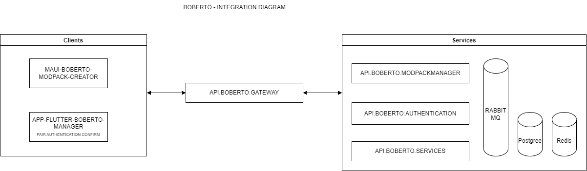

# API-MINECRAFT-SERVER-MODPACK-MANAGER

Esse projeto consiste em uma minimal api utilizada para gerenciar modificações e versionamento do [boberto-minecraft-launcher](https://github.com/brutalzinn/boberto-minecraft-launcher)

> Essa api tem objetivos de fins de aprendizado. Foi utilizada para aprender conceitos de CI/CD utilizando Heroku, Docker e Dokku.

> Qualquer feedback ou dúvida, abra um issue com tag 'question' com sua dúvida ou feedback.

# Diagrama

# Introdução ao Dokku

Dokku é uma plataforma como serviço extensível e de código aberto que é executada em um único servidor de sua escolha. O Dokku suporta a criação de aplicativos em tempo real a partir de um git push via Dockerfile ou detectando automaticamente o idioma com Buildpacks e, em seguida, inicia os contêineres com base na imagem criada. Usando tecnologias como nginx e cron, os processos da Web são roteados automaticamente, enquanto os processos em segundo plano e as tarefas cron automatizadas também são gerenciadas pelo Dokku.

[Documentação Dokku](https://github.com/dokku/dokku)

# Hospedando com Dokku

1.     dokku apps:create minimal-api-dokku-test

2.     dokku builder-dockerfile:set minimal-api-dokku-test  dockerfile-path MinecraftServer.Api/Dockerfile

3.     dokku proxy:ports-add minimal-api-dokku-test http:5000:5555

4.     dokku domains:add minimal-api-dokku-test <domain>

## Demonstração com Dokku

[Clique aqui para acessar o demo usando Dokku](http://159.223.141.136:5000/)

